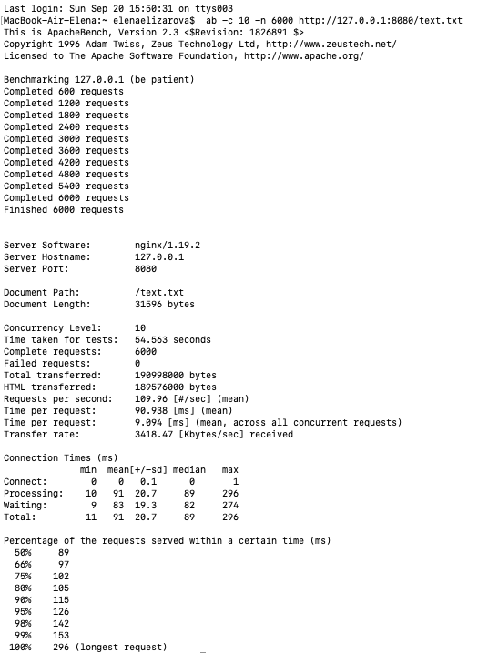
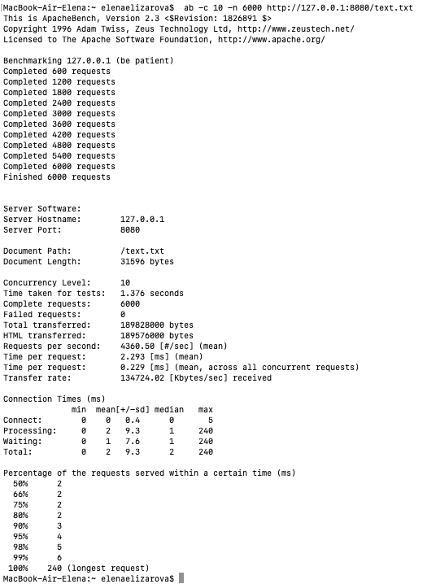

# TPark_static_server
Запуск nginx в docker контейнере.Будет запущен на 8080 порте
```
docker pull nginx
docker run --name nginx -v {absolute path to project folder}/conf/serv.conf:/etc/nginx/conf.d/default.conf:ro -p 8080:80 -v {absolute path to project folder}/static:/usr/share/nginx/html:ro -v {absolute path to project folder}/conf/nginx.conf:/etc/nginx/nginx.conf --cpus=2  -d nginx
```
Запуск проекта
```
cargo build
cargo run
```
Нагрузочное тестирование с помощью ab.
Размер файла - 32Кб
```
ab -c 10 -n 6000 http://127.0.0.1:8080/text.txt
```
Результат для Nginx - 105 RPS



Результат для написанного сервера - 4360 RPS

